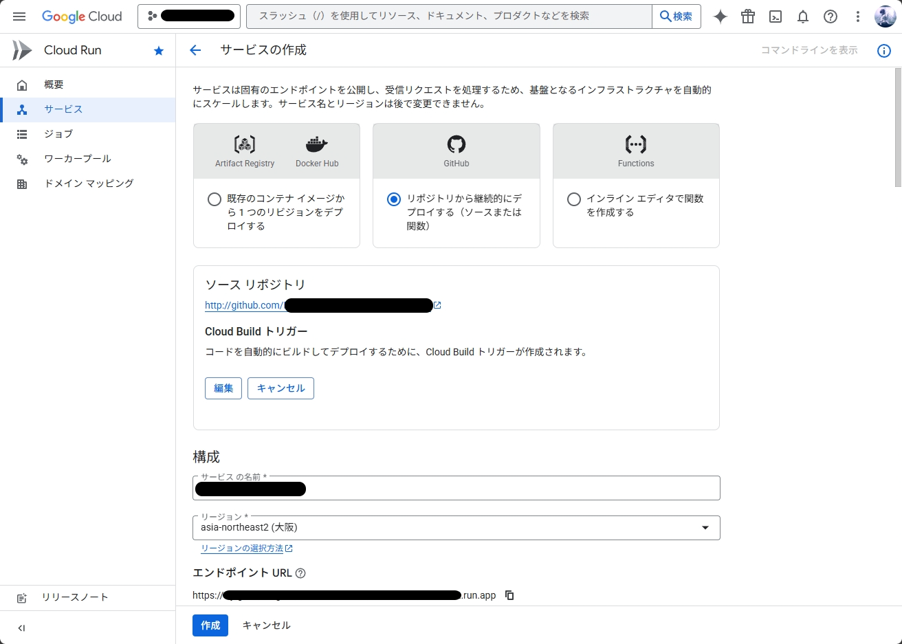
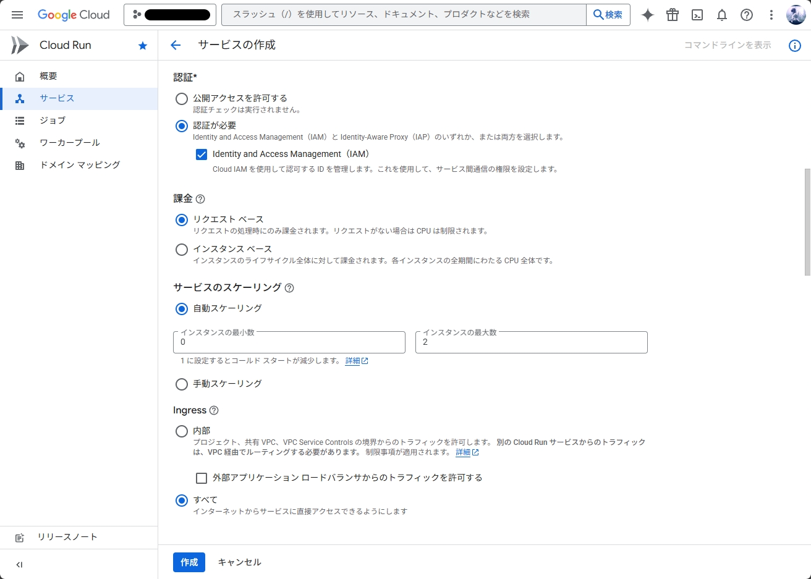
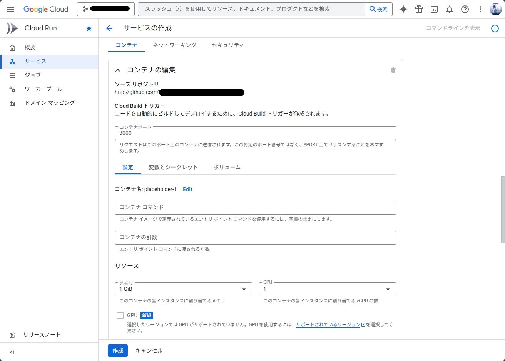
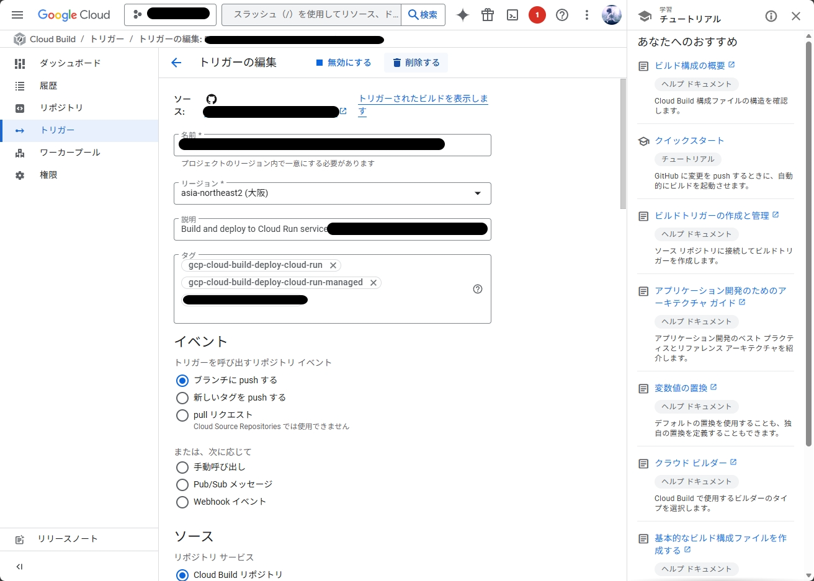
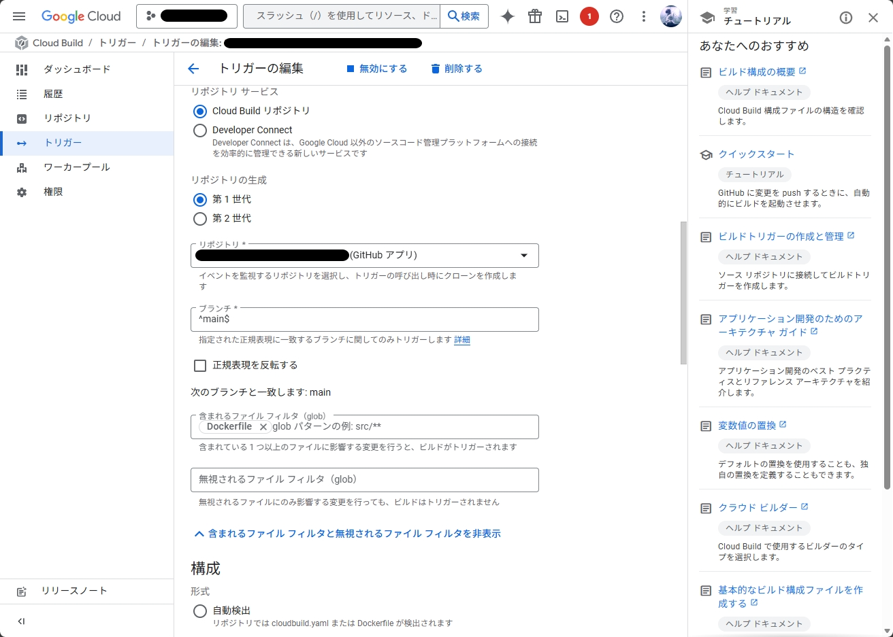
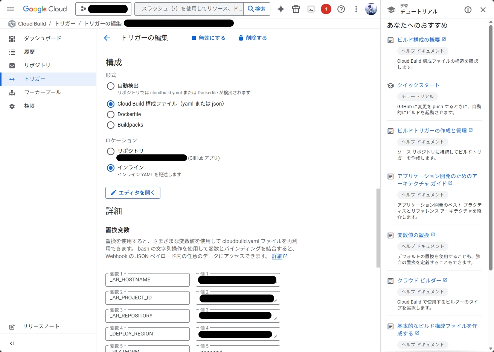
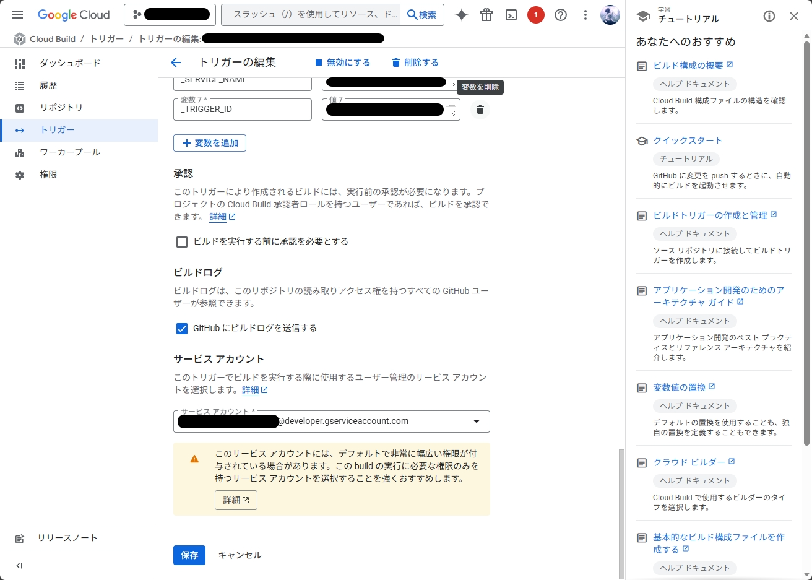
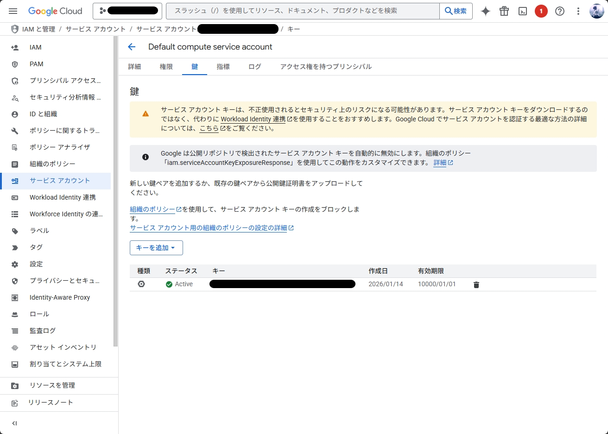

# try-gotenberg-cloud-run

C# から Google Cloud Run にホストされた日本語対応 Gotenberg コンテナを使用して、認証付きで xlsx → pdf に変換するサンプルプロジェクトです。

## プロジェクト構成

```
try-gotenberg-cloud-run/
├── src/
│   └── PdfConversion.ConsoleApp/           # C# コンソールアプリケーション
│       ├── Program.cs                      # メインプログラム
│       ├── PdfConversion.ConsoleApp.csproj # プロジェクトファイル
│       └── SampleFiles/
│           └── 2025年度年間休日表.xlsx     # サンプル Excel ファイル
├── fonts/
│   └── msgothic.ttc                        # 日本語フォント（MS ゴシック）
├── Dockerfile                              # Gotenberg コンテナの日本語対応設定
├── global.json                             # .NET SDK バージョン指定
└── README.md
```

## 技術仕様

- **.NET**: 10.0
- **認証**: Google Cloud IAM（ID トークン）
- **依存パッケージ**: Google.Apis.Auth v1.73.0
- **Gotenberg**: 8-cloudrun（日本語フォント対応）

## Cloud Run: リポジトリを接続したサービスの作成

Cloud Build を設定して GitHub リポジトリからデプロイするようにします。

- IAM を使用した認証が必要
- Gotenberg はデフォルトで 3000 ポートを使用するため、コンテナポートを 3000 に設定
- メモリは 1GiB

<details><summary>Cloud Run: サービスの作成</summary>
<p>







</p>
</details>

Cloud Build でトリガを編集します。

- リージョン: 近所を選択する
- イベント: ブランチに push する
- ソース: Cloud Build リポジトリ

<details><summary>Cloud Build: トリガの編集</summary>
<p>









</p>
</details>

IAM: サービスアカウントでキーを追加します。

- キーを追加することでダウンロードされるサービスアカウントキーファイルを保管

<details><summary>サービスアカウント鍵</summary>
<p>



</p>
</details>

## Dockerfile（日本語対応）

Gotenberg コンテナに日本語フォント対応を追加しています：

```dockerfile
FROM gotenberg/gotenberg:8-cloudrun

# 言語を日本語に
ENV ACCEPT_LANGUAGE=ja-JP

USER root

# フォントのコピー
COPY ./fonts/msgothic.ttc /usr/local/share/fonts/msgothic.ttc

# 日本語パッケージとキャッシュ更新
RUN apt-get update && \
    apt-get install -y fonts-noto-cjk && \
    fc-cache -fv && \
    apt-get clean && rm -rf /var/lib/apt/lists/*

# Gotenberg のデフォルトユーザーに戻す
USER gotenberg
```

## C# からの呼び出し

### 前提条件

- .NET 10.0 SDK のインストール
- `Google.Apis.Auth` NuGet パッケージ（v1.73.0）の追加
- 環境変数 `GOOGLE_APPLICATION_CREDENTIALS` にサービスアカウントキーファイルへのフルパス（JSON）を設定

### 実行方法

1. プロジェクトのビルドと実行：

```bash
cd src/PdfConversion.ConsoleApp
dotnet run
```

2. 実行結果：
   - `SampleFiles/2025年度年間休日表.xlsx` が PDF に変換される
   - 出力ファイル：`年度年間休日表.pdf`

### 主要な実装ポイント

1. **Google Cloud IAM 認証**：
   - `GoogleCredential.GetApplicationDefaultAsync()` でサービスアカウント認証情報を取得
   - `GetOidcTokenAsync()` で Cloud Run 用の ID トークンを生成

2. **Gotenberg API 呼び出し**：
   - `/forms/libreoffice/convert` エンドポイントを使用
   - `MultipartFormDataContent` で Excel ファイルを送信

<details><summary>Program.cs（完全版）</summary>
<p>

```csharp
using System.Net.Http.Headers;
using Google.Apis.Auth.OAuth2;

const string cloudRunUrl = "https://try-gotenberg-cloud-run-523801905704.asia-northeast2.run.app";
const string inputFilePath = "SampleFiles/2025年度年間休日表.xlsx";
const string outputFilePath = "年度年間休日表.pdf";

Console.WriteLine($"{DateTime.Now:HH:mm:ss}: Hello, try-gotenberg-cloud-run!");
try
{
    Console.WriteLine($"{DateTime.Now:HH:mm:ss}: Starting ID token retrieval...");
    var idToken = await GetIdTokenAsync(cloudRunUrl).ConfigureAwait(false);

    Console.WriteLine($"{DateTime.Now:HH:mm:ss}: ID token retrieved successfully.");
    Console.WriteLine($"{DateTime.Now:HH:mm:ss}: Creating HttpClient with Bearer token...");

    using var httpClient = CreateHttpClient(idToken);

    Console.WriteLine($"{DateTime.Now:HH:mm:ss}: HttpClient created successfully.");
    Console.WriteLine($"{DateTime.Now:HH:mm:ss}: Starting XLSX to PDF conversion...");
    
    await httpClient.ConvertXlsxToPdfAsync(cloudRunUrl, inputFilePath, outputFilePath).ConfigureAwait(false);

    Console.WriteLine($"{DateTime.Now:HH:mm:ss}: PDF conversion successful. File saved as '{outputFilePath}'.");
}
catch (Exception ex)
{
    Console.WriteLine($"{DateTime.Now:HH:mm:ss}: An error occurred: {ex.Message}");
}

return;

static async ValueTask<string> GetIdTokenAsync(string audience)
{
    // 1. Google 認証情報の取得（環境変数 GOOGLE_APPLICATION_CREDENTIALS のパスを参照）
    // Audience には Cloud Run の URL を指定します
    var googleCredential = await GoogleCredential.GetApplicationDefaultAsync().ConfigureAwait(false);

    // Cloud Run の IAM 認証には ID トークンが必要です
    // OidcToken オプションを使用して、特定の Audience 用のトークンを取得
    var oidcToken = await googleCredential.GetOidcTokenAsync(OidcTokenOptions.FromTargetAudience(audience));

    // 2. トークンの取得（有効期限内であればキャッシュされたものが返り、切れていれば自動リニューアルされる）
    return await oidcToken.GetAccessTokenAsync().ConfigureAwait(false);
}

static HttpClient CreateHttpClient(string bearerToken)
{
    var httpClient = new HttpClient();
    // 3. ヘッダーに Bearer トークンをセット
    httpClient.DefaultRequestHeaders.Authorization = new AuthenticationHeaderValue("Bearer", bearerToken);
    return httpClient;
}

file static class HttpClientExtensions
{
    extension(HttpClient httpClient)
    {
        public async ValueTask ConvertXlsxToPdfAsync(string gotenbergUrl, string inputXlsxFilePath, string outputPdfFilePath)
        {
            var xlsxBytes = await ReadXlsxFileAsBytesAsync(inputXlsxFilePath).ConfigureAwait(false);
            var pdfBytes = await httpClient.ConvertXlsxToPdfAsync(gotenbergUrl, xlsxBytes ?? []).ConfigureAwait(false);
            await File.WriteAllBytesAsync(outputPdfFilePath, pdfBytes ?? []);
        }

        public async ValueTask<byte[]?> ConvertXlsxToPdfAsync(string gotenbergUrl, byte[] xlsxBytes)
        {
            // 4. Gotenberg (xlsx → pdf) へのリクエスト構築
            using var content = new MultipartFormDataContent();
            using var fileContent = new ByteArrayContent(xlsxBytes);
            fileContent.Headers.ContentType = MediaTypeHeaderValue.Parse("application/vnd.openxmlformats-officedocument.spreadsheetml.sheet");
            content.Add(fileContent, "files", "document.xlsx");

            // Gotenberg の LibreOffice 変換エンドポイント
            var response = await httpClient.PostAsync($"{gotenbergUrl}/forms/libreoffice/convert", content);
            if (response.IsSuccessStatusCode)
            {
                var pdfBytes = await response.Content.ReadAsByteArrayAsync().ConfigureAwait(false);
                return pdfBytes;
            }
            else
            {
                var error = await response.Content.ReadAsStringAsync();
                throw new Exception($"Gotenberg Error: {error}");
            }
        }
    }

    private static async ValueTask<byte[]?> ReadXlsxFileAsBytesAsync(string xlsxFilePath)
    {
        await using var fileStream = File.OpenRead(xlsxFilePath);
        using var memoryStream = new MemoryStream();
        await fileStream.CopyToAsync(memoryStream).ConfigureAwait(false);
        return memoryStream.ToArray();
    }
}
```

</p>
</details>
